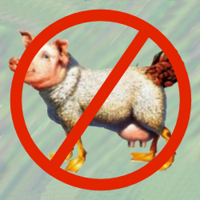

curved-text Widget Interface (API)
=
Principles
-
* In normal use, devs should not have to edit widget files. They should be able to achieve normal things by editing app/index.js, resources/index.view and/or resources/styles.css.

* Interface members should not be provided for every possible capability (because we’d never finish and the widget would consume too much memory).

* Some widget settings can be set once at start-up; some can be changed while the app is running; some can be changed in either way. It isn’t necessary for all settings to be changeable in every possible way. The appropriate way(s) to change each setting should be determined by likely sensible usage.

* Settings that can’t be implemented safely (eg, slow to run but tempting to animate) should probably not be implemented.

Priorities
-

* E: essential (MVP). Must be done for initial release.

* D: desirable. Do for initial release if easy; otherwise later.

* N: nice to have. Do later, if feasible.

* L: luxury. Do later, if bored.

* —: not worth doing.

Static and Infrequently-Changing Settings
-
Options:

* SVG; eg, `fill="red"` or `<set href="#position" attributeName="cx" to="100" />`. This is convenient for specifying a setting at build-time (only).

* CSS: eg, `.fill:red;`. This is convenient for specifying a setting at build-time (only).

* Object property (not implemented yet); eg, `{fill:'0xFF0000'}`. This would allow concise initialisation of multiple settings when the widget is created (only) in ts/js.

* ts/js: property setter or function; eg, `myWidget.fill='0xff0000'` or `myWidget.setCenter(100,200)`. This allows values to be changed via ts/js while the app is running. In general, use a setter if only one argument; otherwise use a function.

| Setting | SVG | CSS | Object property | ts/js | settings |
| --- | --- | --- | --- | --- | --- |
| text.text | E ✔ | — | N | E |   |
| font-family | E ✔ | D |  |  |   |
| font-size | E ✔ | D |  |  |  |
| fill | ✔ (1) | D |  |  |  |
| cx | ✔ |  |  | D | |
| cy | ✔ |  |  | D | |
| r | ✔ |  |  | D |  |
| mode |  |  |  | D |  |
| textAnchor |  |  |  | D | |
| letterSpacing |  |  |  | D |  |
| charAngle |  |  |  | D |  |
| rotateText |  |  |  | D | |

(1) Doesn't seem to require any code in widget.