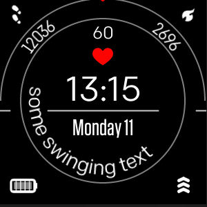

curved-text
=
(under construction!)\
\
`curved-text` is a widget for `Fitbit OS` using inbuilt fonts to create curved texts.

Supported by the `widget-factory`, it enables you to create multiple curved texts, which properties and attributes can be set individually per `id` or for multiple elements via `class`.

\
Set up the curve your text gets aligned at:
 -
 * x 
 * y
 * r

 Attributes to set text and style
 -
 * text
 * text-buffer
 * font-family
 * font-size
 * fill
 * letter-spacing
 * text-anchor

 * opacity
 * display

Rotate whole text
 -
 * start-angle

 In the default `auto-mode`, the position of each char gets calculated by its width (using getBBox()), plus additional letter-spacing if set.

If 
 * sweep-angle\
 is set, it switches to `fix-mode` where each character gets rotated by the chosen fix += angle.

 To ensure high flexibility, most attributes/properties can be set in
 * SVG
 * CSS
 * .ts/.js
 and can be changed on runtime.

 The `<use>` elements representing your curved text can be animated like other SVGElements.

For information on `installation` and `usage`, please follow this link:
[installation and usage](usage.md)

 