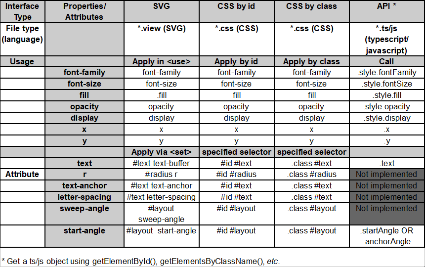

curved-text
=

**curved-text** is a widget for **Fitbit OS** using inbuilt fonts to create multilple and independant curved texts supported by the widget-factory.\
You can use it under `vanilla javascript` (studio or CLI) as well as running `typescript`.

Possible individual settings:

 * Radius of the `circles`, the texts gets curved at, as well as all `text-` and `font-properties` and `-attributes`.
 * Setting the radius r < 0 switches the appearance of your text to bottom-curved.
 * x,y here determine the `center`(!) of your curved-text elements circle.
 * There are two `modes` to rotate text: default is `auto`, setting `sweep-angle` switches to `fix` where the chars get rotated by += sweepAngle.
 

!<div align="center"></div>


Installation
=

**/app**

Copy the complete `/app/widgets` folder  into your project's `/app` folder (so that you then have an `/app/widgets` folder in your project).


**/resources/widgets**

Copy the complete `/resources/widgets` folder  into your project's `/resources` folder (so that you then have a `/resources/widgets` folder in your project).

In your `/resources/widget.defs` file, within the `<defs>` section, add the following lines:


```js
<defs>
    ...
    <link rel="stylesheet" href="widgets/curved-text/styles.css"/>
    <link rel="import" href="widgets/curved-text/index.view"/>
</defs>
```
In your `/resources/index.view` file, include `<use>` elements for every instance of curved-text that you want.\
Your `<use>` elements must include `href="#curvedText"`, and you'll need to give each element an id

```js
<use id="myLabel" href="#curvedText"/>
```
See detailed documentation below, and examples in this repository.

**/app/index.js**

**Imports and Initialisation**

Add the following two import statements near the top:

```js
//IMPORT WIDGET-FACTORY AND CURVED-TEXT
import { widgetFactory } from './widgets/widget-factory';
import { curvedText } from './widgets/curved-text';

//INITIALISE CURVED-TEXT
widgetFactory(curvedText);
```

 ...or, if your multiple widgets are all located within a child element called  `myGroupElement`, you can use this form:

 ```js
//INITIALISE WIDGET_FACTORY AND WIDGETS
widgetFactory(myGroupElement, curvedText);
```

If you haven't already got an `import` statement for `document`, add that too.

In order to use `curved-text` and `widget-factory` in your typescript project, please follow the additional instructions here: [typescript_interface](doco/typescript.md).


Your Code
=
Get and use objects that correspond to the curved-text `<use>` elements in your `index.view` file in the normal way:
```js
const myLabel = document.getElementById('myLabel');
const myClass = document.getElementsByClassName('myClass');

myLabel.text = today.adjusted.steps;
```

Due to the structure of the `<use>` there are a few cases in which you'll need a `<set>` in SVG or specified selectors in CSS for your settings. Others can be written directly into the `<use>` line.. 

Settings
=
!<div align="center"></div>

For more detailed information, see [installation and usage](doco/usage.md), detailed examples of usage and syntax at [syntax attachment](doco/snippets.md).

---

...and now - CURVE IT!\
by BarbWire and Gondwana


(and RTFM! :slightly_smiling_face::vulcan_salute:)

[curved-text-demo](https://github.com/BarbWire-1/curved-text-demo)\
!<div align="center"></div>

If you're curious about how the code files in this clockface work together to let you create and manipulate widgets, see [How the Widget Factory Works](doco/how-the-factory-works.md).

If you would like to know how to turn your own elements into a reusable component, see [How to Make a Widget](doco/how-to-widget.md).