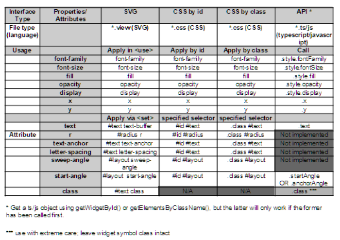

Installation
=
/app
-
Copy the complete `/app/widgets` folder  into your project's `/app` folder\
 (so that you then have an `/app/widgets` folder in your project).


/resources/widgets
-
Copy the complete `/resources/widgets` folder  into your project's `/resources` folder\
(so that you then have a `/resources/widgets` folder in your project).

In your `/resources/widget.defs` file, within the `<defs>` section, add the following lines:

>`<link rel="stylesheet" href="widgets/curved-text/styles.css" />`

>`<link rel="import" href="widgets/curved-text/index.view" />`

/resources/index.gui (or .view)
-
In your `/resources/index.view` file, include `<use>` elements for every instance of curved-text that you want. Your `<use>` elements must include `href="#curvedText"`, and you'll need to give each element an id; *eg*, `id="stepsCurvedText"` like:
  >`<use id="myLabel" href="#curvedText" >`

See detailed documentation below, and examples in this repository.

>**Note:** Unlike most Fitbit elements and components, widgets won't be visible just because you've included them in your `.view` file. Widgets need some internal code to be executed to lay them out, and this doesn't happen until you get a reference to them using `document.getWidgetById()` in your code (see below).

/app/index.js (or .ts)\
Imports and setup
-
In your `/app/index.js` (or `.ts`) file, add the following two import statements near the top:
> `import widgetFactory from './widgets/widget-factory'`

> `import curvedText from './widgets/curved-text'`

If you haven't already got an `import` statement for `document`, add that too.

In your `/app/index.js` (or `.ts`) start-up code:

* Create a variable for a `widgetFactory` object, and tell it about curved-text widgets, like this:
> `const widgets = widgetFactory([curvedText]);`

* Use the ```widgetFactory``` object to add a `getWidgetById()` function to your `document` variable, like this:
> `widgets.registerContainer(document);`\

>**Note:** You can also add `getWidgetById()`to other container elements, such as `svg`, `section` and `g`. To do so, use `getElementById()` to get an object for the container element, then pass that to `registerContainer()`. You can call `registerContainer()` multiple times, or pass multiple arguments in one call. You don't have to use it on the `document` object if you always intend to get widgets from within subordinate container elements.

In order to use `curved-text` and `widget-factory` in your typescript project, please follow the additional instructions here: [typescript_interface](typescript.md).

Your code
=

Now, elsewhere in your `/app/index.js` (or `.ts`) file, you can get objects that correspond to the curved-text `<use>` elements in your `index.view` file, like this:
>`const myLabel = document.getWidgetById('myLabel');`\
>`const myClass = document.getElementsByClassName('myClass');`\
>**Note:** Accessing widgets by className requires that each widget has been previously created using `.getWidgetById()`. Hopefully this limitation will be fixed in future.)

In your code, use your widget object(s) to interact with the corresponding curved-text element; *eg*:

> `myLabel.text = today.adjusted.steps;`

Summary of Attribute Accessibility
-

This table summarises the properties and settings that are available, and where they can be set. For more detail, see [code snippets](snippets.md).

!<div align="center"></div>